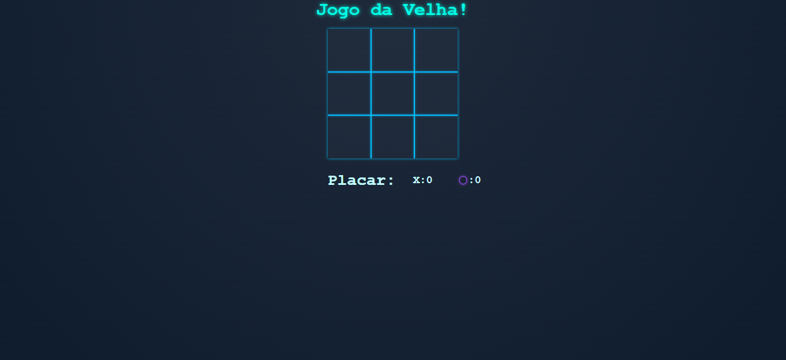

# Jogo da Velha Futurista

Um jogo da velha moderno com visual neon/futurista, desenvolvido com HTML, CSS e JavaScript. Este projeto possui modo para dois jogadores e contra IA, interface adaptada a um tema escuro elegante.

## 🕹️ Funcionalidades

-   Interface responsiva e minimalista com tema neon
-   Modo local para 2 jogadores (X vs O)
-   Modo contra IA (X vs Computador)
-   Placar atualizado automaticamente
-   Efeitos visuais suaves e estilizados
-   Código limpo e modularizado

## 🎨 Tecnologias utilizadas

-   HTML5
-   CSS3
-   JavaScript (puro)

## 📁 Como rodar

1. Clone o repositório:

```bash
git clone https://github.com/kiminfodeveloper/jogo_da_velha
```

2. Abra o arquivo index.html em seu navegador preferido.

Não é necessário instalar dependências ou servidores locais.
O jogo pode ser executado diretamente no navegador.

## Preview




## 📄 Licença

Este projeto está sob a licença MIT. Veja o arquivo LICENSE para mais detalhes.

## 👨‍💻 Desenvolvido por Kevyn Melo
